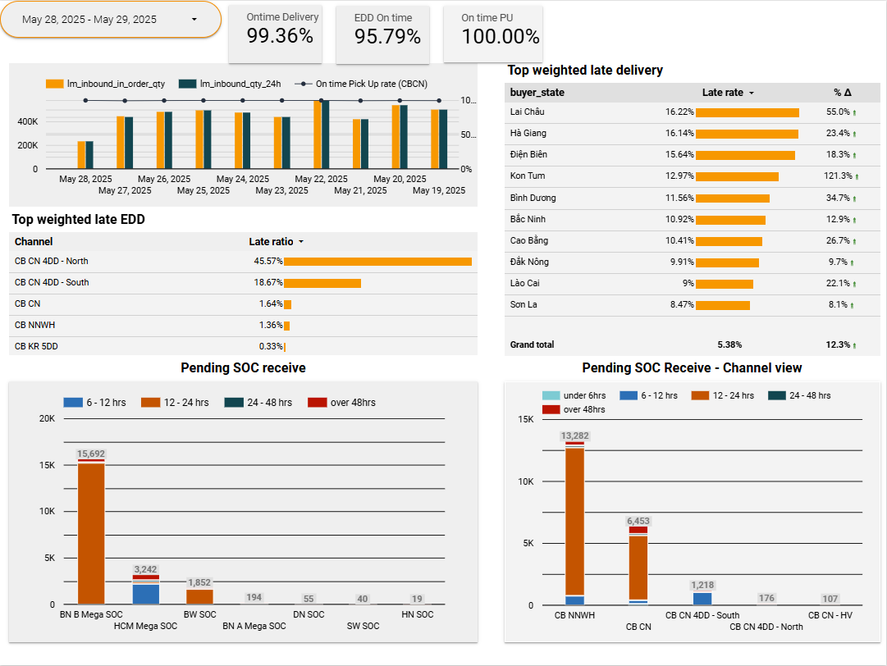

# 3PL Performance Management
An interactive Google Sheets-based dashboard for tracking and visualizing the daily performance of third-party logistics (3PL) partners in Cross-Border operations.

## 🎯 Objective
This dashboard helps logistics teams monitor:
- Daily inbound volume vs 24h performance
- SLA compliance (On-time delivery, EDD on-time, Pickup punctuality)
- Key delay drivers by channel and province
- Pending backlog by aging and location

## 📌 Key Metrics Displayed

| KPI                     | Description                                              |
|-------------------------|----------------------------------------------------------|
| ✅ On-time Delivery     | % of parcels delivered on or before the committed date   |
| ⏱️ EDD On-time          | % of parcels delivered within Estimated Delivery Date    |
| 📦 On-time Pickup (PU)  | % of SOC parcels picked up by 3PL within SLA             |
| 🚨 Top Delay Drivers    | Weighted delay analysis by buyer's province & route      |
| ⏳ Pending SOC Receive  | Volume & aging buckets of parcels yet to be received     |

## 📈 Sample Dashboard View

## 🧰 Tech Stack
- **Google Sheets**: Data aggregation
- **Google Apps Script**: Automation of data refresh, formula parsing
- **Looker Studio**: Visualization data
- 
## 🛠️ How It Works

1. **Data Pipeline**  
   Daily performance data is pushed daily to a Google Sheet.

2. **Automation Script**  
   Google Apps Script processes inbound and outbound volumes, SLA checks, and calculates KPIs.

3. **Visualization**  
   Built-in charts track:
   - Inbound vs 24h performance
   - SLA trend by date
   - Late EDD ratio by route
   - Top 10 late delivery provinces
   - Pending SOC parcels by site/channel/aging bucket
